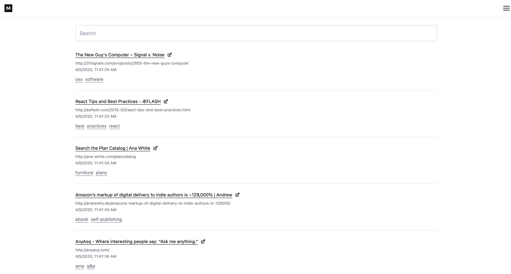
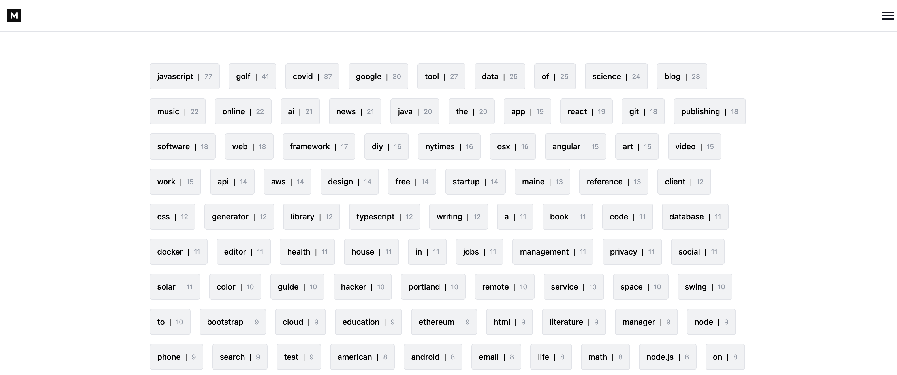

## Mark

dead simple bookmarking app

supports auth via https://github.com/denoland/deno_kv_oauth

add a `.env`:

```
# false will disable auth
PRODUCTION=true

# or whatever oauth provider you set up
GH_CLIENT_ID=[your-id]
GH_CLIENT_SECRET=[your-secret]

# if importing from the pocket api
POCKET_CONSUMER_KEY=[your-key]
```

then

```
deno task start
```

use with a bookmarklet like so:

```
javascript:(() => {
  const currentUrl = encodeURIComponent(window.location.href);
  window.open(`http://localhost:8000/mark?url=${currentUrl}`, "_blank");
})();
```







